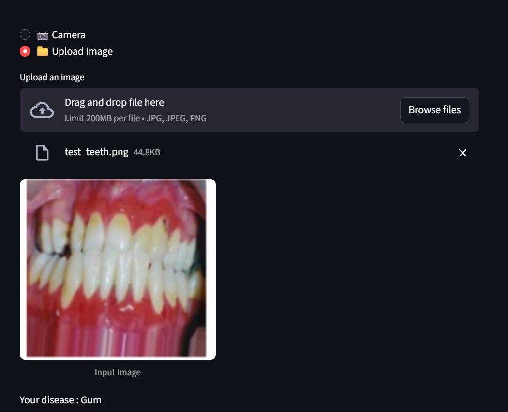

# 🦷 Teeth Disease Classification  

This project focuses on building a deep learning classifier to detect **7 different teeth diseases** from dental images. We implemented two approaches:  

1. **Model from scratch** (custom CNN)  
2. **Transfer Learning** (using pretrained models)  

Additionally, we developed a **Graphical User Interface (GUI)** for real-time image classification.  

---

## 📌 Project Overview  

- Dataset was **unbalanced** (some categories had half the samples compared to others).  
- Applied techniques to address class imbalance:  
  - **Class weights** in training  
  - **Data augmentation** (applied only to low-sample classes)  
- Performed **visualization and analysis** to better understand dataset and results:  
  - Class distribution plots  
  - Augmented images vs. original images comparison  
  - Confusion matrices  
  - Precision, Recall, and F1-score evaluation  

---

## 🗂️ Project Structure  

📂 Teeth-Disease-Classification
┣ 📓 Teeth_Classification.ipynb # Custom CNN model
┣ 📓 Teeth_Classification_transferLearning.ipynb # Transfer learning approach
┣ 📂 teeth.py # GUI implementation (not upload weights due to size)
┣ 📂 dataset # Dataset (not uploaded due to size)
┣ 📂 results # Saved plots, confusion matrices, reports

---

## 🧑‍💻 Methodology  

1. **Data Preprocessing**  
   - Image resizing and normalization  
   - Applied augmentation (rotation, flipping, zooming, etc.) on minority classes  

2. **Model 1: From Scratch**  
   - Built a CNN architecture from the ground up  
   - Tuned hyperparameters with early stopping and dropout
   - we need to decrease number of paramters 
3. **Model 2: Transfer Learning**  
   - Used pretrained networks (VGG16 get perfect result)  
   - Fine-tuned top layers for our dataset  

4. **Evaluation**  
   - Metrics: Accuracy, Precision, Recall, F1-score  
   - Confusion matrices to assess per-class performance  

---

## 📊 Results  

### Confusion Matrix Example  
  

### Precision & Recall Comparison  
  

---

## 🖥️ GUI  

We developed a simple **Streamlit GUI** to test the trained models.  
- Users can upload or capture an image.  
- Model predicts one of the **7 teeth diseases**.  
- Displays confidence scores.  

  

---

